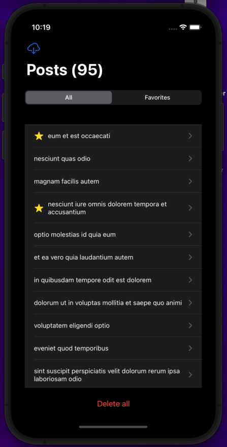

JSON Placeholder is and beautiful and dynamic example app, this application was made independently and published on github as a guide for other iOS Developers.  It was created a "Helpers" 💼 folder to organize the constants, handlers and extensions.

### Tech specs:

- Language: Swift
- Framework: SwiftUI ✨ + Combine
- Design Pattern: MVVM
- Persistency: Core Data
- Dependency manage: Swift Package Manager
- Tests: Unit Testing / UI Testing

### Core Data
Has been added debug mode on RUN Schema `-com.apple.CoreData.SQLDebug 1`, if you want to check 😉 database just open logs and looking for path. 

### Author:
-  💻 Victor Castro [@victorcastro](https://github.com/victorcastro)
